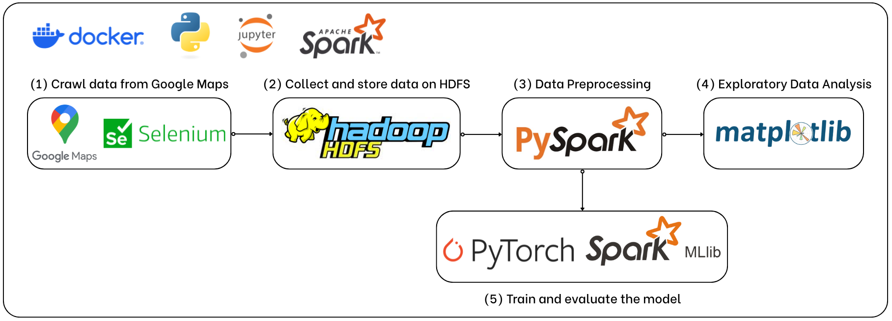

# Sentiment Analysis on KFC reviews from Google Maps
This is a group project on Sentiment Analysis using Big Data framework Apache Hadoop and Apache Spark. For ease of deployment, we opt for a multi-container Docker application to install the necessary service: Hadoop, Spark, Python and Jupyter.\
The project aims to develop a classification model on general comments about the chain KFC. In order to train the model, we crawled reviews from KFC locations within Hồ Chí Minh city on Google Maps.

#### Table of Contents
- [**Overview**](#overview)
    - [Deploying the Docker Application](#docker_deploy)
    - [Crawling Reviews from Google Maps](#reviews_crawl)
    - [Processing data with PySpark](#reviews_store)
    - [Model Training and Evaluation](#models)
- [**Results and Dicussion**](#results-and-discussion)
- [**Acknowledgements**](#acknowledgements)
- [**References**](#references)

## Overview
The whole project can be best explained by the following figure:

*Figure: The project's overall workflow*

<b>Deploying the Docker Application</b>

Taking advantage of pre-built Docker images, we opt for multi-container Docker application for quick deployment of the working environment.\
In the application, we deploy two images provided by [`big-data-europ/docker-hadoop`](https://github.com/big-data-europe/docker-hadoop). These images are responsible for the Hadoop HDFS service within the project.\
For processing with Spark, we use the official [`jupyter/pyspark-notebook`](https://hub.docker.com/r/jupyter/pyspark-notebook) image. The latest image has Python 3.11.6 installed with PySpark. The image also hosts a local JupyterLab session where one can easily connect to from outside of the Docker container.

For more information on the application, see [`docker-hadoop/README.md`](./docker-hadoop/README.md)
To see how one deploys, runs as well as connecting to the JupyterLab instance, visit [`how_tos.ipynb`](how_tos.ipynb).

<b>Crawling Reviews from Google Maps</b>

After setting up the application, we then began the core of the project. The first task of which we need to do is to find a way to collect reviews from places on Google Maps.

Google themselves provide a [Google Places API](https://developers.google.com/maps/documentation/places/web-service/overview) for retrieving multiple types of data about a place on Google Maps including reviews. However, this is meant as a freemium service and the quota is relatively low compare to our needs. Furthermore, you need to to set up a billing account in order to use the API, which is also slightly inconvenient for us.

Thus, the only option left is to resort to crawling data straight from the site. Because the site is not static by nature, we uses [selenium](https://pypi.org/project/selenium/) to simulate certain loading functionalities and interactions within the website. We provide the crawling code packaged in a class wrapper `ReviewCrawler` provided in [ggplace_review_crawler](./review_crawl/ggplace_review_crawler/). For more information on how to use the package, see [README.md](./review_crawl/README.md).

While crawling, we immediately save the results to the HDFS using the Python API [hdfs](https://hdfscli.readthedocs.io/en/latest/).

<b>Processing data with PySpark</b>

[Apache Spark](https://spark.apache.org/) is a framework for processing big data with distributed computing. Spark allows seamless integration with multiple big data storage infrastructures like the HDFS we have deployed as well as analytics and science computing frameworks like R, NumPy, etc. In this project, we utilise the Spark's API for Python called [PySpark](https://spark.apache.org/docs/latest/api/python/index.html) to do any data processing.

More specifically, we deploy PySpark through the prebuilt Docker image [jupyter/pyspark-notebook](https://hub.docker.com/r/jupyter/pyspark-notebook). This image allows you to host a local JupyterLab session with pre-installed libraries necessary for processing with PySpark, allowing an easy deployment. When doing data processing, you can connect to the server from a Jupyter notebook or work within the Web UI. For instructions and demonstrations on this subject, see the `Executing Python scripts within the application` and `Accessing HDFS from PySpark Session` sections in [`how_tos.ipynb`](how_tos.ipynb).

<b>Model Training and Evaluation</b>

For classification models, we chose to train a Logistic Regression model and a simple Multi-layer Perceptron neural network. The details of how models are trained are discussed in [`sentiment_analysis/README.md`](./sentiment_analysis/README.md).

However, because our dataset are quite imbalanced, especially with neutral reviews, we decided to compare models using class-wise metrics. More specifically, we compute precision, recall and F1 measure for each class and compare both models. The full results can be found in [`sentiment_analysis/model_eval.ipynb`](./sentiment_analysis/model_eval.ipynb).

## Results and Discussion

## Acknowledgements
## References
### Our contributors:

